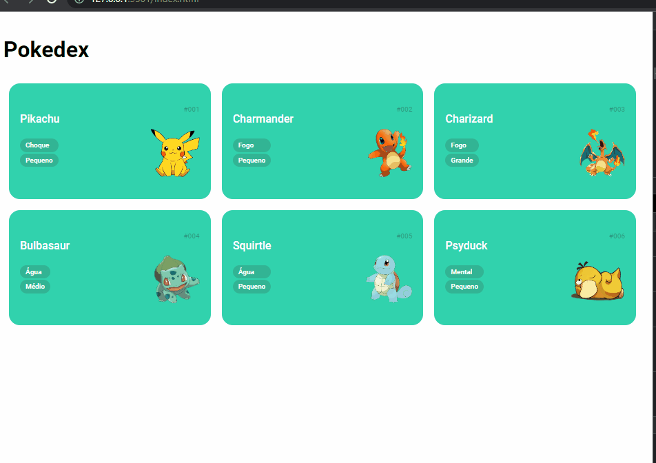

<h1 align="center">

    

Projeto Pokedex
</h1>

Temos um projeto de cards de Pokemons criado inicialmente pelo programa de treinamento Orange+ pela plataforma Dio.
 

<h2 align="center">*** Tecnologias Utilizadas ***</h2>
<ul>
    <li>HTML ✏️</li>
    <li>CSS 🎨</li>
    <li>JS 🧐</li>
</ul>

<h2 align="center">*** Como Utilizar ***</h2>

Exibe cardes de Pokémon e os seus atributos de acordo com a sua classe. Responsividade
 aplicada parcialmente. Abaixo uma breve apresentação do sistema:

Gif - funcionalidades do sistema

<h2 align="center">*** Link da página ***</h2>

Abaixo temos o link da página para visualização e testes:

🔗 <a href="https://oseiasweb.github.io/dio-pokedex/" target="_blank" class="linkedin">Projeto Pokedex</a> 

 
<h2 align="center">*** Status Projeto ***</h2>

